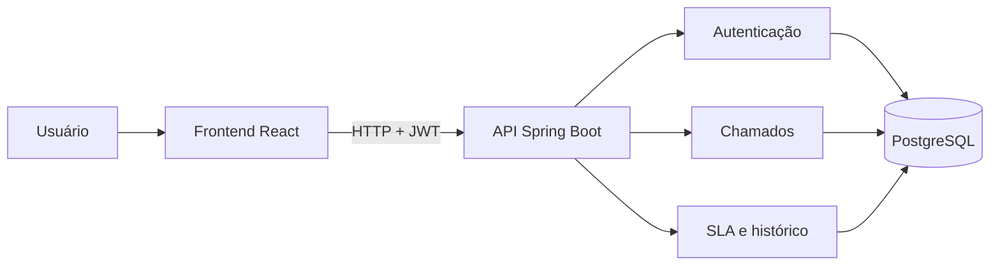
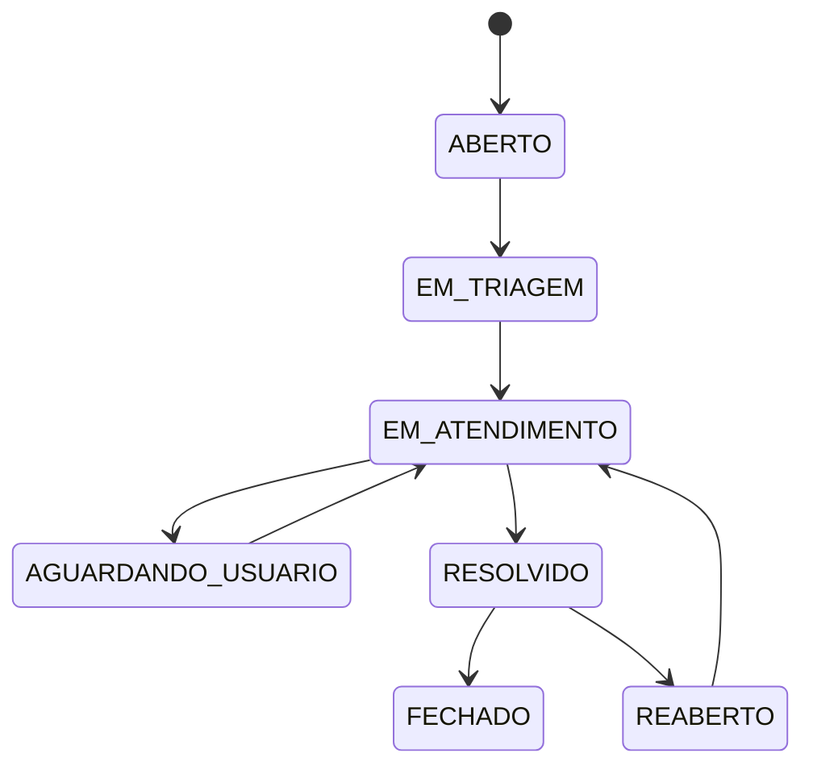

# Arquitetura inicial

O projeto utiliza um monorepo para manter API, interface e infraestrutura versionadas em conjunto. O backend começa como um monólito modular, adequado ao escopo do produto e fácil de executar localmente.

## Perfis

- `SOLICITANTE`: abre chamados e acompanha os próprios atendimentos.
- `TECNICO`: recebe, classifica e atende chamados atribuídos.
- `ADMIN`: administra usuários, categorias e regras gerais.

## Estados iniciais do chamado

