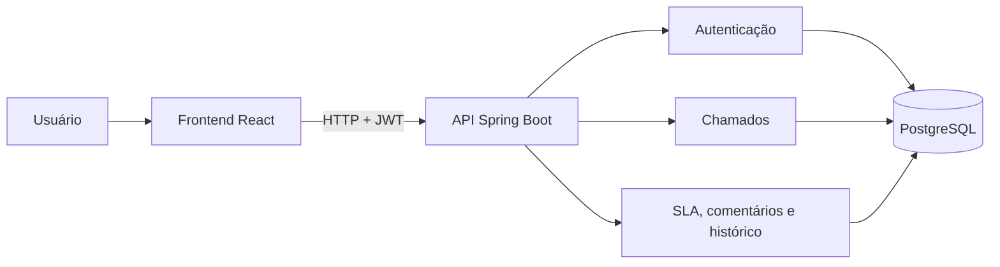
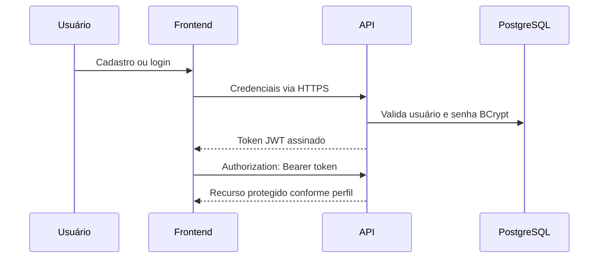
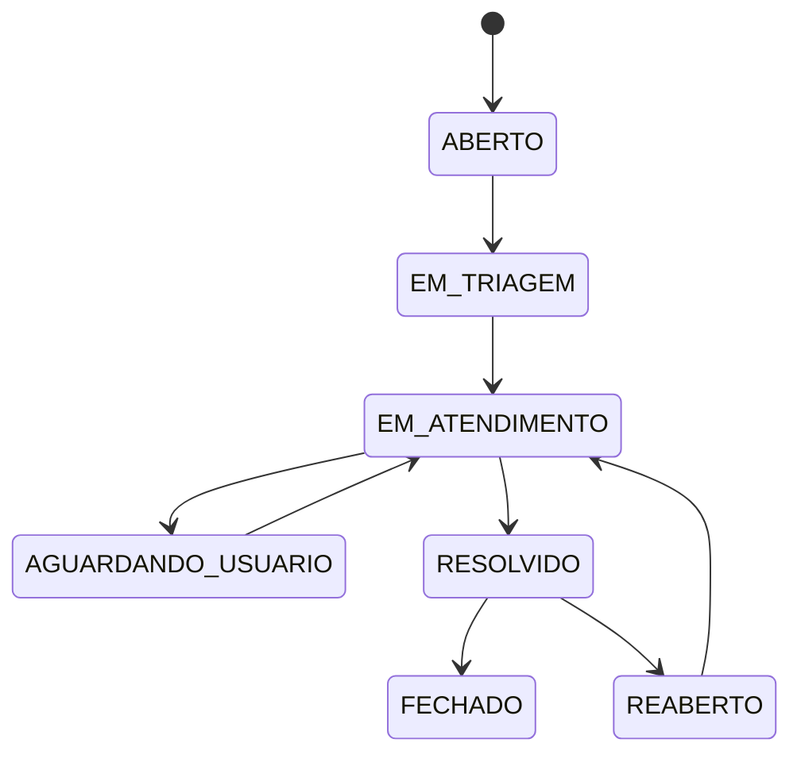

# Arquitetura inicial

O projeto utiliza um monorepo para manter API, interface e infraestrutura versionadas em conjunto. O backend começa como um monólito modular, adequado ao escopo do produto e fácil de executar localmente.

## Perfis

- `SOLICITANTE`: abre chamados e acompanha os próprios atendimentos.
- `TECNICO`: recebe, classifica e atende chamados atribuídos.
- `ADMIN`: administra usuários, categorias e regras gerais.

## Fluxo de autenticação

O cadastro público cria somente solicitantes. A elevação para `TECNICO` ou `ADMIN` será uma operação administrativa protegida.

## Isolamento de dados

- Solicitantes listam e consultam apenas chamados vinculados ao próprio e-mail autenticado no JWT.
- A tentativa de consultar um chamado de outro solicitante retorna `404`, evitando revelar que o registro existe.
- Técnicos e administradores podem consultar a fila geral.
- Somente o solicitante pode editar ou excluir o próprio chamado, e apenas enquanto o status for `ABERTO`.

## Atendimento e auditoria

- O administrador promove usuários e atribui chamados a técnicos ativos.
- Ao receber um técnico, o chamado aberto entra automaticamente em `EM_TRIAGEM`.
- Técnicos alteram apenas chamados atribuídos a eles; administradores podem atuar em toda a fila.
- As transições seguem a máquina de estados documentada abaixo. Saltos inválidos retornam `409 Conflict`.
- Criação, atribuição e mudança de status são registradas em `ticket_history`, com autor, data, estados e observação.

## Comentários e SLA

- Solicitantes e suporte podem registrar comentários públicos em chamados que conseguem visualizar.
- Somente técnicos e administradores criam e consultam comentários internos.
- O prazo é calculado na abertura conforme a prioridade: 4 horas para crítica, 8 para alta, 24 para média e 48 para baixa.
- A API classifica o SLA como no prazo, em risco, vencido ou concluído. O estado de risco começa nos 25% finais do prazo.
- A documentação OpenAPI fica disponível em `/v3/api-docs`, com uma interface interativa em `/swagger-ui.html`.

## Consulta e indicadores

- A listagem oferece busca textual e filtros por status, prioridade, categoria e técnico.
- A paginação é executada no banco de dados e o frontend navega em páginas de dez registros.
- O resumo operacional contabiliza toda a visão permitida ao usuário, não apenas a página atual.
- O mesmo escopo de segurança é aplicado à listagem e aos indicadores: solicitantes veem somente seus dados e a equipe de suporte acessa a fila geral.

## Catálogo de categorias

- O catálogo mantém nomes padronizados para classificação dos chamados.
- Apenas administradores criam, renomeiam, ativam ou desativam categorias.
- Solicitantes e técnicos consultam somente categorias ativas.
- Chamados novos ou editados validam a categoria no backend; categorias inativas permanecem registradas nos chamados antigos para preservar o histórico.

## Armazenamento de anexos

- A tabela `ticket_attachments` mantém nome original, tipo, tamanho, responsável e vínculo com o chamado.
- O conteúdo é armazenado fora do banco em um diretório configurável, usando identificadores aleatórios como nome físico.
- Upload, listagem e download reutilizam o isolamento por solicitante; técnicos e administradores acessam a fila geral.
- O backend limita arquivos a 5 MB e aceita somente PDF, PNG, JPEG e texto simples.
- Ao excluir um chamado aberto, seus metadados e arquivos físicos também são removidos.

## Alertas de SLA

- Um agendador avalia periodicamente os chamados ainda não concluídos.
- Ao entrar em risco ou vencer, o sistema notifica o solicitante e o técnico responsável, quando houver.
- A restrição única por chamado, destinatário e tipo impede alertas duplicados.
- Cada usuário consulta e marca como lidas somente as próprias notificações.

## Estratégia de testes

- Os testes de API usam H2 em modo compatível com PostgreSQL para feedback rápido.
- Uma suíte com Testcontainers inicia PostgreSQL 16 e executa as migrations Flyway do zero.
- O teste real confirma a validação do esquema pelo Hibernate e a persistência dos relacionamentos principais.
- O GitHub Actions executa as duas camadas em cada push e Pull Request.

## Estados iniciais do chamado

